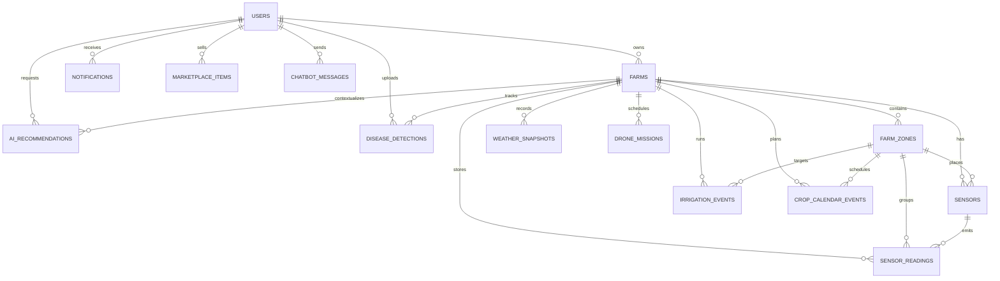

# AgriSense AI Backend Architecture

AgriSense AI uses a modular FastAPI backend with PostgreSQL, SQLAlchemy ORM, JWT authentication, role-based access control, and WebSockets for live IoT updates. The backend is organized around domain modules so the project can grow from a university demo into a commercially credible agri-tech platform.

## 1. Full Database Schema

### users

| Column | Type | Notes |
| --- | --- | --- |
| id | UUID PK | Primary user identity |
| full_name | VARCHAR(120) | Farmer/admin name |
| email | VARCHAR(255) UNIQUE | Login identifier |
| phone | VARCHAR(40) NULL | SMS notification target |
| password_hash | VARCHAR(255) | Bcrypt/Argon2 hash only |
| role | ENUM | `admin`, `farmer`, `agronomist`, `operator` |
| preferred_language | VARCHAR(12) | UI/chatbot language |
| avatar_url | TEXT NULL | Optional profile image |
| is_active | BOOLEAN | Soft access control |
| is_verified | BOOLEAN | Future email verification |
| created_at | TIMESTAMPTZ | Audit timestamp |
| updated_at | TIMESTAMPTZ | Audit timestamp |

### farms

| Column | Type | Notes |
| --- | --- | --- |
| id | UUID PK | Farm identity |
| owner_id | UUID FK users.id | Farm owner |
| name | VARCHAR(160) | Farm display name |
| location_name | VARCHAR(255) | Human-readable address |
| latitude | NUMERIC(10,7) | Farm geolocation |
| longitude | NUMERIC(10,7) | Farm geolocation |
| total_area_hectares | NUMERIC(10,2) | Farm size |
| soil_type | VARCHAR(80) | Loam, clay, sandy, etc. |
| water_source | VARCHAR(120) NULL | Tank, canal, borewell |
| created_at | TIMESTAMPTZ | Audit timestamp |
| updated_at | TIMESTAMPTZ | Audit timestamp |

### farm_zones

| Column | Type | Notes |
| --- | --- | --- |
| id | UUID PK | Zone/plot identity |
| farm_id | UUID FK farms.id | Parent farm |
| name | VARCHAR(120) | Zone display name |
| crop_name | VARCHAR(120) | Current crop |
| area_hectares | NUMERIC(10,2) | Zone area |
| irrigation_mode | ENUM | `manual`, `automatic`, `scheduled` |
| moisture_min_threshold | NUMERIC(5,2) | Auto-irrigation lower bound |
| moisture_max_threshold | NUMERIC(5,2) | Auto-irrigation upper bound |
| created_at | TIMESTAMPTZ | Audit timestamp |

### sensors

| Column | Type | Notes |
| --- | --- | --- |
| id | UUID PK | Sensor identity |
| farm_id | UUID FK farms.id | Parent farm |
| zone_id | UUID FK farm_zones.id NULL | Optional zone |
| name | VARCHAR(120) | Sensor label |
| sensor_type | ENUM | `soil_moisture`, `temperature`, `humidity`, `water_tank`, `ph`, `npk`, `light`, `multi` |
| status | ENUM | `online`, `offline`, `maintenance`, `fault` |
| hardware_id | VARCHAR(120) UNIQUE | Device identifier |
| firmware_version | VARCHAR(40) NULL | Firmware metadata |
| battery_level | NUMERIC(5,2) | Percentage |
| signal_strength | NUMERIC(5,2) | Percentage/RSSI-derived |
| last_seen_at | TIMESTAMPTZ NULL | Device heartbeat |
| created_at | TIMESTAMPTZ | Audit timestamp |

### sensor_readings

| Column | Type | Notes |
| --- | --- | --- |
| id | UUID PK | Reading identity |
| sensor_id | UUID FK sensors.id | Source device |
| farm_id | UUID FK farms.id | Denormalized for query speed |
| zone_id | UUID FK farm_zones.id NULL | Denormalized for query speed |
| soil_moisture | NUMERIC(6,2) NULL | Percent |
| temperature | NUMERIC(6,2) NULL | Celsius |
| humidity | NUMERIC(6,2) NULL | Percent |
| water_tank_level | NUMERIC(6,2) NULL | Percent |
| ph_level | NUMERIC(4,2) NULL | Soil pH |
| nitrogen | NUMERIC(8,2) NULL | mg/kg |
| phosphorus | NUMERIC(8,2) NULL | mg/kg |
| potassium | NUMERIC(8,2) NULL | mg/kg |
| light_intensity | NUMERIC(10,2) NULL | Lux |
| anomaly_score | NUMERIC(5,3) NULL | ML/rule anomaly score |
| recorded_at | TIMESTAMPTZ INDEX | Sensor timestamp |

### irrigation_events

| Column | Type | Notes |
| --- | --- | --- |
| id | UUID PK | Event identity |
| farm_id | UUID FK farms.id | Parent farm |
| zone_id | UUID FK farm_zones.id NULL | Target zone |
| triggered_by_id | UUID FK users.id NULL | User or automation owner |
| mode | ENUM | `manual`, `automatic`, `scheduled` |
| status | ENUM | `started`, `stopped`, `completed`, `failed` |
| water_used_liters | NUMERIC(12,2) | Usage estimate |
| reason | TEXT NULL | AI/rule explanation |
| started_at | TIMESTAMPTZ | Start time |
| ended_at | TIMESTAMPTZ NULL | Stop time |

### ai_recommendations

| Column | Type | Notes |
| --- | --- | --- |
| id | UUID PK | Recommendation identity |
| farm_id | UUID FK farms.id | Related farm |
| zone_id | UUID FK farm_zones.id NULL | Related zone |
| user_id | UUID FK users.id | Requesting user |
| recommendation_type | ENUM | `crop`, `fertilizer`, `yield`, `irrigation`, `weather_risk` |
| title | VARCHAR(180) | Human-readable title |
| result | JSONB | Model output |
| input_features | JSONB | Model inputs |
| confidence_score | NUMERIC(5,4) | 0 to 1 |
| model_version | VARCHAR(80) | Traceability |
| created_at | TIMESTAMPTZ | Audit timestamp |

### disease_detections

| Column | Type | Notes |
| --- | --- | --- |
| id | UUID PK | Detection identity |
| farm_id | UUID FK farms.id | Related farm |
| zone_id | UUID FK farm_zones.id NULL | Related zone |
| user_id | UUID FK users.id | Uploader |
| crop_name | VARCHAR(120) | Crop context |
| image_url | TEXT | Uploaded/served image |
| disease_name | VARCHAR(160) | Model prediction |
| severity | ENUM | `low`, `medium`, `high`, `critical` |
| confidence_score | NUMERIC(5,4) | 0 to 1 |
| treatment_advice | TEXT | Actionable guidance |
| prevention_advice | TEXT | Future mitigation |
| created_at | TIMESTAMPTZ | Audit timestamp |

### notifications

| Column | Type | Notes |
| --- | --- | --- |
| id | UUID PK | Notification identity |
| user_id | UUID FK users.id | Recipient |
| farm_id | UUID FK farms.id NULL | Optional farm |
| notification_type | ENUM | `sensor`, `irrigation`, `weather`, `ai`, `marketplace`, `system` |
| channel | ENUM | `in_app`, `email`, `sms`, `push` |
| severity | ENUM | `info`, `warning`, `critical` |
| title | VARCHAR(180) | Notification title |
| message | TEXT | Notification body |
| metadata | JSONB | Deep link/context |
| is_read | BOOLEAN | Inbox state |
| created_at | TIMESTAMPTZ | Audit timestamp |

### marketplace_items

| Column | Type | Notes |
| --- | --- | --- |
| id | UUID PK | Listing identity |
| seller_id | UUID FK users.id | Seller |
| title | VARCHAR(180) | Listing title |
| category | ENUM | `seeds`, `fertilizer`, `equipment`, `produce`, `service` |
| description | TEXT | Listing body |
| price | NUMERIC(12,2) | Unit price |
| quantity | NUMERIC(12,2) | Available quantity |
| unit | VARCHAR(40) | kg, bag, hour |
| image_url | TEXT NULL | Listing image |
| status | ENUM | `draft`, `active`, `sold`, `archived` |
| created_at | TIMESTAMPTZ | Audit timestamp |

### weather_snapshots

| Column | Type | Notes |
| --- | --- | --- |
| id | UUID PK | Snapshot identity |
| farm_id | UUID FK farms.id | Farm location |
| temperature | NUMERIC(6,2) | Celsius |
| humidity | NUMERIC(6,2) | Percent |
| rainfall_mm | NUMERIC(8,2) | Rainfall |
| wind_speed | NUMERIC(8,2) | km/h |
| condition | VARCHAR(120) | Weather condition |
| risk_level | ENUM | `low`, `medium`, `high`, `critical` |
| captured_at | TIMESTAMPTZ | Weather timestamp |

### chatbot_messages

| Column | Type | Notes |
| --- | --- | --- |
| id | UUID PK | Message identity |
| user_id | UUID FK users.id | User |
| farm_id | UUID FK farms.id NULL | Farm context |
| role | ENUM | `user`, `assistant`, `system` |
| message | TEXT | Chat message |
| language | VARCHAR(12) | Message language |
| metadata | JSONB | Retrieval/model metadata |
| created_at | TIMESTAMPTZ | Audit timestamp |

### drone_missions

| Column | Type | Notes |
| --- | --- | --- |
| id | UUID PK | Mission identity |
| farm_id | UUID FK farms.id | Target farm |
| created_by_id | UUID FK users.id | Operator |
| mission_name | VARCHAR(160) | Mission title |
| status | ENUM | `planned`, `in_progress`, `completed`, `failed` |
| flight_path | JSONB | Coordinates/waypoints |
| imagery_url | TEXT NULL | Orthomosaic/video placeholder |
| ai_findings | JSONB | Stress/disease/waterlogging findings |
| scheduled_at | TIMESTAMPTZ NULL | Planned time |
| completed_at | TIMESTAMPTZ NULL | Completion time |

### crop_calendar_events

| Column | Type | Notes |
| --- | --- | --- |
| id | UUID PK | Calendar event identity |
| farm_id | UUID FK farms.id | Farm |
| zone_id | UUID FK farm_zones.id NULL | Zone |
| crop_name | VARCHAR(120) | Crop |
| activity_type | ENUM | `sowing`, `irrigation`, `fertilizing`, `spraying`, `harvesting`, `inspection` |
| title | VARCHAR(180) | Event title |
| notes | TEXT NULL | Details |
| scheduled_for | TIMESTAMPTZ | Due date |
| completed_at | TIMESTAMPTZ NULL | Completion date |
| status | ENUM | `pending`, `completed`, `skipped`, `overdue` |

## 2. ER Diagram Explanation



Core data ownership flows from `users` to `farms`, then from `farms` to `farm_zones`, sensors, readings, irrigation, AI decisions, weather, crop calendar, and drone missions. `sensor_readings` intentionally stores `farm_id` and `zone_id` as denormalized fields to support fast dashboard charts without repeated joins.

## 3. Tables and Relationships

- `users` has many `farms`, `notifications`, `ai_recommendations`, `disease_detections`, `marketplace_items`, and `chatbot_messages`.
- `farms` belongs to one owner and has many `farm_zones`, `sensors`, `sensor_readings`, `irrigation_events`, `weather_snapshots`, `drone_missions`, and `crop_calendar_events`.
- `farm_zones` belongs to one farm and groups sensors, readings, irrigation events, AI recommendations, disease detections, and calendar events.
- `sensors` belongs to a farm and optionally a zone; each sensor emits many readings.
- `irrigation_events` belongs to a farm, optionally a zone, and optionally a user who triggered it.
- `ai_recommendations` and `disease_detections` preserve model inputs/outputs for auditability.
- `notifications` are user-facing events and can link back to farms through metadata.
- `marketplace_items` are seller-owned listings.
- `weather_snapshots`, `chatbot_messages`, `drone_missions`, and `crop_calendar_events` support advanced product surfaces.

## 4. Backend Folder Structure

```txt
backend/
├── app/
│   ├── api/v1/routes/
│   ├── core/
│   ├── db/
│   ├── models/
│   ├── schemas/
│   ├── services/
│   ├── websocket/
│   ├── utils/
│   └── main.py
├── docs/
├── tests/
├── Dockerfile
├── requirements.txt
└── .env.example
```

## 5. API Route Structure

```txt
/api/v1/auth
  POST /register
  POST /login
  GET  /me

/api/v1/users
  GET  /
  GET  /{user_id}
  PATCH /me

/api/v1/farms
  GET  /
  POST /
  GET  /{farm_id}
  PATCH /{farm_id}
  DELETE /{farm_id}

/api/v1/sensors
  GET  /farm/{farm_id}
  POST /
  POST /readings
  GET  /readings/{farm_id}

/api/v1/irrigation
  POST /start
  POST /stop
  GET  /history/{farm_id}

/api/v1/ai
  POST /crop-recommendation
  POST /fertilizer-recommendation
  POST /yield-prediction

/api/v1/disease-detection
  POST /
  GET  /farm/{farm_id}

/api/v1/notifications
  GET  /
  PATCH /{notification_id}/read

/api/v1/marketplace
  GET  /
  POST /
  PATCH /{item_id}

/api/v1/analytics
  GET /dashboard/{farm_id}
  GET /sensor-trends/{farm_id}

/api/v1/weather
  GET  /farm/{farm_id}
  POST /snapshot

/api/v1/chatbot
  POST /message
  GET  /history

/api/v1/drone
  GET  /missions/{farm_id}
  POST /missions

/api/v1/crop-calendar
  GET  /farm/{farm_id}
  POST /
  PATCH /{event_id}

/ws/sensors/{farm_id}
/ws/alerts/{user_id}
```

## 6. Models

SQLAlchemy models use UUID primary keys, typed columns, explicit enums, timestamp mixins, and relationship definitions. The initial code scaffold includes all domain tables and can later be upgraded with Alembic migrations.

## 7. Pydantic Schemas

Schemas are split by domain and separate:

- `Create` schemas for inbound POST payloads.
- `Update` schemas for PATCH payloads.
- `Read` schemas for outbound API responses.
- Specialized request/response schemas for login, tokens, AI calls, chatbot messages, analytics, and sensor ingestion.

## 8. Services Layer

The service layer contains business rules and persistence operations:

- `AuthService`: registration, login, password verification.
- `FarmService`: farm ownership and zone management.
- `SensorService`: ingestion, latest values, historical readings, alert triggers.
- `IrrigationService`: manual/automatic irrigation events.
- `AIService`: crop, fertilizer, and yield recommendation facade.
- `DiseaseService`: disease detection facade.
- `NotificationService`: in-app/SMS/email orchestration.
- `AnalyticsService`: dashboard aggregates and chart series.
- `WeatherService`: weather snapshots and risk labels.
- `ChatbotService`: AI assistant message persistence and response generation.
- `DroneService`: drone mission planning and AI findings.
- `CropCalendarService`: crop tasks and overdue tracking.

## 9. Authentication Flow

1. User registers with email, password, and role.
2. Backend validates email uniqueness and hashes the password.
3. User logs in using OAuth2-compatible email/password form.
4. Backend verifies credentials and returns a signed JWT access token.
5. Protected routes depend on `get_current_user`.
6. Role-protected routes use `require_roles(...)`.
7. WebSocket clients authenticate with a JWT token query parameter.

## 10. Middleware Structure

- `TrustedHostMiddleware` restricts valid hostnames in production.
- `CORSMiddleware` allows configured frontend origins only.
- `RequestIdMiddleware` attaches a request id for traceability.
- `ProcessTimeMiddleware` records latency headers and logs slow requests.
- Future middleware: rate limiting, IP reputation, audit trail.

## 11. Error Handling Strategy

- Domain exceptions inherit from `AgriSenseError`.
- Global exception handlers return consistent JSON errors.
- Authentication errors return `401`.
- Permission errors return `403`.
- Missing records return `404`.
- Validation remains FastAPI/Pydantic-native with `422`.
- Unexpected errors are logged server-side and returned as safe generic `500` messages.

## 12. Logging System

- JSON-like structured logs through Python `logging`.
- Request id propagated through middleware.
- Auth failures, alert emissions, irrigation actions, sensor anomalies, and AI calls are logged.
- Production deployments should forward logs to a managed sink.

## 13. Security Best Practices

- Store only password hashes.
- Use strong JWT secrets from environment variables.
- Keep short access-token lifetimes.
- Enforce RBAC on admin and operator endpoints.
- Restrict CORS origins.
- Validate all external API responses.
- Sanitize uploaded disease images and enforce size/type limits.
- Never log raw passwords, full JWTs, or sensitive credentials.
- Use parameterized SQLAlchemy queries.
- Add rate limiting to auth, chatbot, and upload endpoints before public deployment.
- Run behind HTTPS in production.
